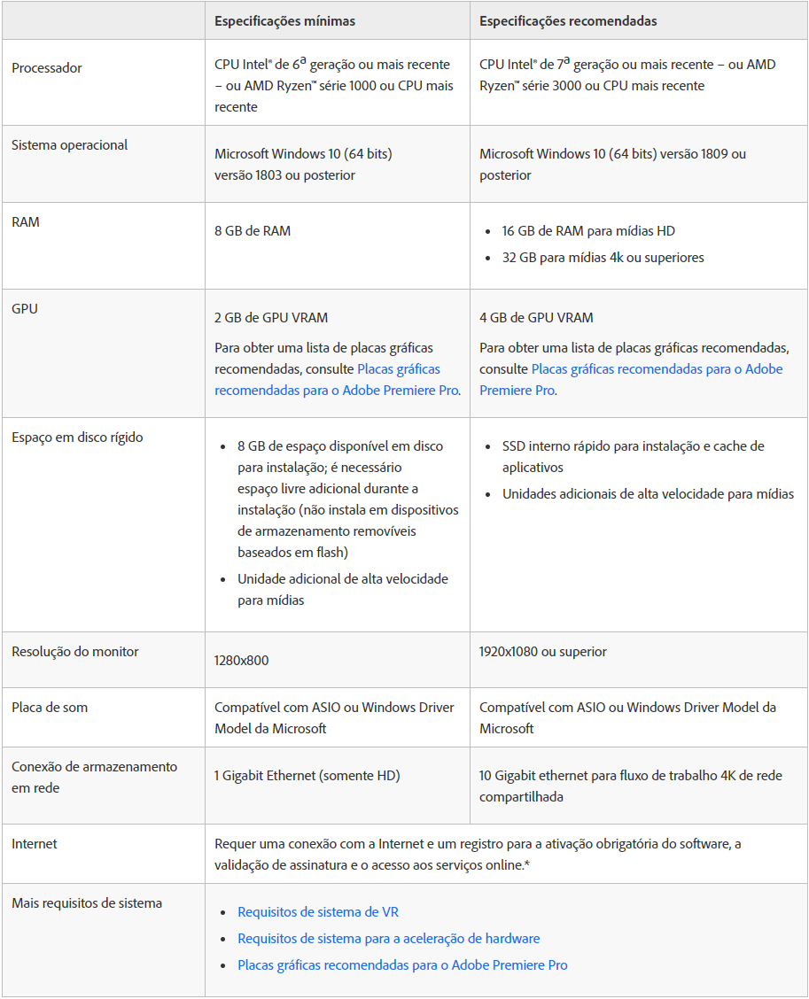

> Vou deixar aqui abaixo os requisitos de alguns dos programas da Adobe.

***
<h2 align="center"><strong>Requisitos mínimos e recomendados de sistema para Photoshop</strong></h2>

 

 [Link da página da Adobe](https://helpx.adobe.com/br/photoshop/system-requirements.html "Link da página da Adobe diretamente para os requisitos do Photoshop.") diretamente para os requisitos do Photoshop.

---
 <h2 align="center"><strong>Requisitos mínimos de sistema para o Illustrator</strong></h2>

 

 [Link da página da Adobe](https://helpx.adobe.com/br/illustrator/system-requirements.html "Link da página da Adobe diretamente para os requisitos do Illustrator.") diretamente para os requisitos do Illustrator.

---
<h2 align="center"><strong>Requisitos mínimos de sistema para o After Effects<strong></h2>

 
 [Link da página da Adobe](https://helpx.adobe.com/br/after-effects/user-guide.html/br/after-effects/system-requirements.ug.html "Link da página da Adobe diretamente para os requisitos do After Effects.") diretamente para os requisitos do After Effects.

---
<h2
align="center"><strong>Requisitos de sistema do Premiere Pro</strong></h2>

 

 [Link da página da Adobe](https://helpx.adobe.com/br/premiere-pro/user-guide.html/br/premiere-pro/system-requirements.ug.html "Link da página da Adobe diretamente para os requisitos do Premiere Pro.") diretamente para os requisitos do Premiere Pro.

---
# Então Neres
 coloquei os requisitos desses programas ai, para você ter uma base das configurações que o notebook vai precisar ter. Eu vou colocar algumas sugestões de notebook que na minha opinião vai te atender bem para o que você esta precisando.

## Basicamente a configuração do notebook pode ser a seguinte...
CPU | RAM | SSD | VRAM |
--- | --- | --- | ---- |
i5 de 7ª geração ou superior | no mínimo 8GB | 480GB | no mínimo 2GB dedicada |

> Com o SSD tu vai ter mais rapidez nas tarefas e inicialização dos programas, trazendo assim uma produtividade bem maior. Fora que para a realização de multi tarefas o SSD  vai te proporcionar bem mais qualidade.
---
## Mas também podemos substituir o SSD por um HDD de 1TB
CPU | RAM | HDD | VRAM |
--- | --- | --- | ---- |
i5 de 7ª geração ou superior | no mínimo 8GB | 1TB | no mínimo 2GB dedicada |
---
# Algumas sugestões!
## Notebook Lenovo Ideapad S145

### Especificações técnicas.
**Processador**
- Intel Core i5-8265U

- Quad Core / 8 Threads

- 6MB

- 1.6GHZ (3.9GHZ Max Turbo)

**Memória RAM**
- 8GB

- 4GB soldado + 4GB slot DDR4 2400MHz

- Expansível até 20GB (4GB soldado + 16GB slot DDR4 2400MHz)

**HD**
- 1TB 5400 RPM

**Placa de vídeo:**
- NVIDIA® GeForce® MX110 com 2GB dedicados GDDR5

>[Link do site](https://www.kabum.com.br/cgi-local/site/produtos/descricao_ofertas.cgi?codigo=115256 "Notebook Lenovo Ideapad S145") Com o valor e a descrição completa.

---
## Notebook Dell Ultrafino I15-7572-A30C 

### Especificações Técnicas

**Processador**
- Intel Core i7-8550U (8MB Cache, até 4.0 GHz)

**Memória RAM**
- 16GB

**SSD**
- 128GB

**HD**
- 1TB

**Placa de Vídeo**	
- NVIDIA GeForce MX150 com 4GB GDDR5

>[Link do site](https://www.realnovidades.com/item/Notebook-Dell-Ultrafino-I15%252d7572%252dA30C-Intel-Core-i7-16GB-(GeForce-MX150-com-4GB)-1TB-128GB-SSD-Tela-Full-HD-.html "Notebook Dell Ultrafino I15-7572-A30C") Com o valor e a descrição completa.
---
## Notebook Asus VivoBook 15 X512FB-BR501T

### Especificações Técnicas

**Processador**
- Intel® Core™ i5 10210U

**Memória RAM**
- 8GB

**HD**
- 1TB

**Placa de Vídeo**	
- Nvidia MX110 com 2GB GDDR5

 >[Link do site](https://www.fastshop.com.br/web/p/d/UXX512FBBR501_PRD/notebook-asus-vivobook-15-intel-core-i5-10210u-8gb-1tb-tela-de-156-nvidia-mx110-cinza-x512fb-br501t "Notebook Asus VivoBook 15 X512FB-BR501T") Com o valor e a descrição completa.

 ---

 ## Notebook Samsung Book X40

### Especificações Técnicas

**Processador**
- Intel® Core™ i5 10ª geração 10210U

**Memória RAM**
- 8GB

**HD**
- 1TB

**Placa de Vídeo**	
- Nvidia MX110 com 2GB GDDR5

 >[Link do site](https://www.magazineluiza.com.br/notebook-samsung-book-x40-intel-core-i5-8gb-1tb-156-placa-de-video-2gb-windows-10/p/225395600/in/nsbo/ "Notebook Samsung Book X40") Com o valor e a descrição completa.
 
 # Essas foram as sugestões. 

 Com certeza existem muitas opções no mercado, minha pesquisa teve como base o desempenho e o custo do notebook.

 Teve algumas coisas que eu não considerei, porque ia aumentar muito no valor do notebook. Mas acredito que dentro das sugestões que fiz, qualquer uma delas vai te adenter muito bem. E claro que são apenas sugestões, use
 elas como base para fazer a compra do teu notebook.

 Deixei todos os links dos sites de cada uma das sugestões.

 Qualquer dúvida é só falar. :+1:
